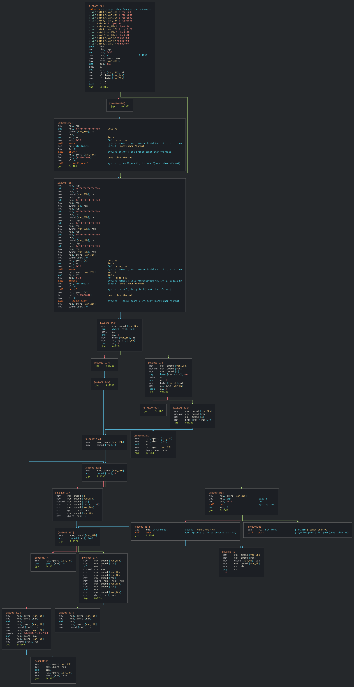

<!--
 * @Author: V4kst1z (dcydane@gmail.com)
 * @Date: 2021-08-19 18:22:30
 * @LastEditors: V4kst1z
 * @Description: 
 * @FilePath: /ollvm-deobfuscator/README.md
-->
# ollvm-deobfuscator
这个项目是因为看到 `retdec` 可以把 `bin` 转成 `llvm ir`，所以就写了个 `llvm pass` 来对 `ollvm` 进行解混淆，可是最后发现 `retdec` 似乎有些问题，转成 `llvm ir` 后再编译成 `bin` 会崩溃，所以在测试的时候没法验证做的对不对，不知道是 retdec 的问题还是 `pass` 的问题。本来这个 `pass` 是基于 `retdec` 生产的 `llvm ir` 处理的，但是后来测试的时候发现 `clang` 生成的 `llvm ir` 也可以被解混淆。

这个放到以后完善吧。

下面是对 `test5.c` 执行控制流平坦化和伪造控制流混淆后的 `cfg` 图和反混淆后的 `cfg` 图的对比(反混淆用的是 `clang` 生成的 `llvm ir`，因为用 `retdec` 生成的 `llvm ir` 转成 `bin` 执行时崩溃，有可能是 `retdec` 生成的 `llvm ir` 有问题吧？)

